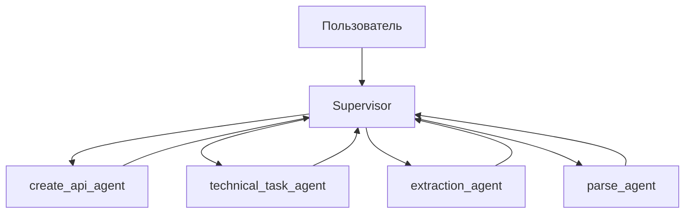

# 🚀 DOC.AI — Интеллектуальный ассистент для автоматизации документации и технических задач

## 💡 **Суть проекта**
DOC.AI — это интеллектуальный ассистент для автоматизации создания технических заданий, документации и других текстовых материалов. Система преобразует хаотичные, неформальные идеи в четкие, структурированные документы, готовые к использованию.

**Целевая аудитория:** программисты, бухгалтеры, студенты и школьники, которым регулярно приходится писать документы: от технических заданий до учебных работ.

**Примеры возможностей:**
- Генерация технических заданий с учетом всех требований для разработчиков
- Создание описаний лабораторных работ для студентов
- Генерация учебных заданий с адаптацией.
- Извлечение данных из файлов (PDF, DOCX, TXT).
- Формирование структурированных документов без ручного копирования информации

## **Почему это ценно?**
- **Автоматизация рутинных задач** — экономия до 70% времени на создание документации
- **Унификация требований** — снижение ошибок из-за неясности формулировок (никаких "квадратов вместо кругов")
- **Работа с файлами** — извлечение и структурирование данных из документов различного формата
- **Адаптивность** — система автоматически подстраивается под сложность задачи и целевую аудиторию
- **Надежность** — 0% ошибок в сгенерированном коде и документации

## ⚙️ **Архитектура системы**
DOC.AI построен на современной многоагентной архитектуре с использованием LLM-моделей и key-value хранилища для управления состоянием и контекстом. Система основана на центральном компоненте - Supervisor, который управляет всем процессом.

### 🔄 Основной рабочий поток

Где:
- `Supervisor` — центральный компонент системы, который:
  * Включает человека в цикл обработки (human in the loop)
  * Распределяет задачи и вызывает других агентов
  * Имеет память для хранения контекста общения с пользователем

- `create_api_agent` — отвечает за:
  * Поиск в интернете
  * Создание документации по коду и запросу пользователя

- `technical_task_agent` — отвечает за:
  * Поиск в интернете
  * Создание ТЗ по запросу пользователя

- `extraction_agent` — отвечает за:
  * Извлечение содержимого документов
  * Извлечение JSON из текста
  * Извлечение данных из файлов

- `parse_agent` — отвечает за:
  * Выполнение Python-кода
  * Сохранение скриптов
  * Преобразование пользовательских данных в различные форматы и сохранение их

## 📊 **Ключевые метрики эффективности**
- **93% точность** извлечения данных из документов
- **4.8 из 5** – оценка полезности сгенерированных технических заданий от пользователей
- **0% ошибок** в системе — отсутствие сбоев за период тестирования
- **21 секунда** — среднее время ответа (в 3 раза быстрее ручного написания)
- **5000–6300 токенов** — стоимость генерации сценария, что делает решение экономически выгодным

## **Технический стек**
- Язык программирования: Python 3.13
- LLM-модель: xiaomi/mimo-v2-flash:free с сайта OpenRouter
- Агентная архитектура: Многопоточные агенты с обратной связью и циклической оптимизацией
- Интерфейс: Консольный UI с возможностью работы с файлами различного формата
